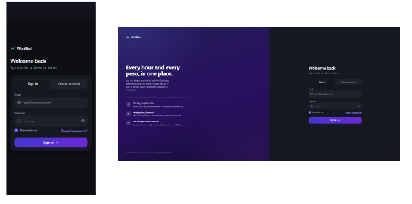
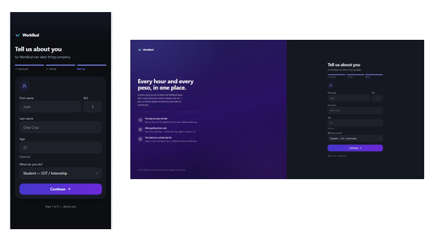
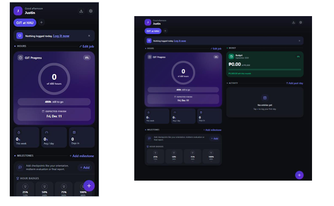
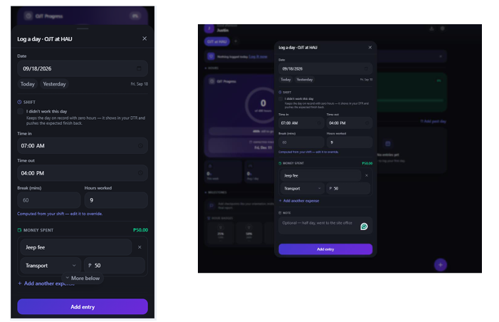
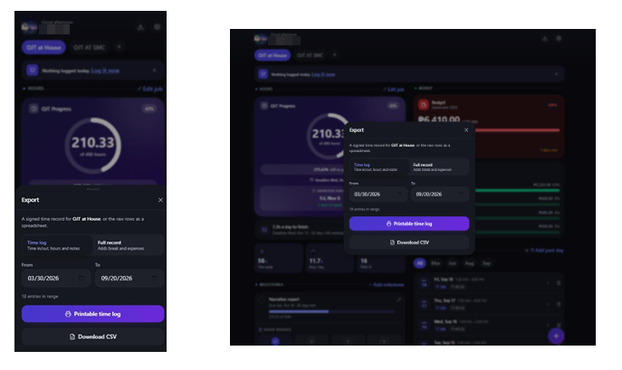
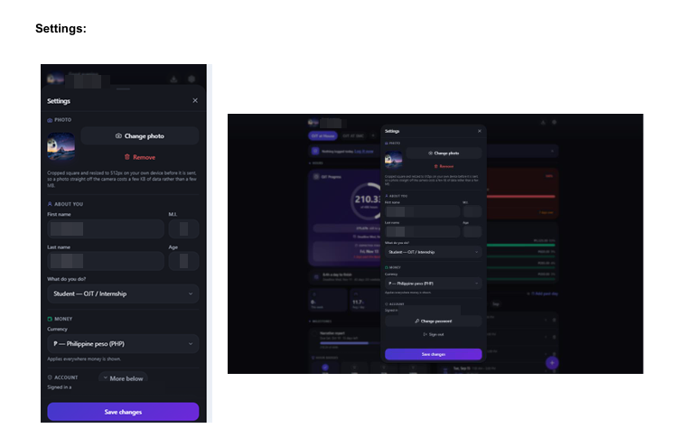

[](AI-USAGE.md)

# WorkBud

OJT hours and expense tracker.

**Live:** [workbud-ph.vercel.app](https://workbud-ph.vercel.app/)

**Demo video:** [video, slides and square image on Google Drive](https://drive.google.com/drive/folders/1ws2guOP-WJ-NwuA1P8lmsicYdH91E59I?usp=sharing)

> Built with help from Claude (Anthropic), with ChatGPT and Gemini used on a couple of earlier bug fixes. I ask the AI first what the structure of a feature should be and for an example of how it should be done, build the feature with that structure and example as my guide and test it, then ask it again when something does not work or could be cleaner or more efficient; Claude also gave me the first draft of the Supabase backend, wrote the Express API server in `server/`, and helped write the documentation. Full details in [AI-USAGE.md](AI-USAGE.md).

---

## 1. Overview

WorkBud is a mobile-first web app (an installable PWA) for tracking on-the-job-training hours and the money a placement costs you. You log each day you work (time in, time out, unpaid break, and what you spent getting there), and the app keeps three things for you:

- the running hour total your school asks for;
- an itemised picture of your spending;
- an export you can hand to a coordinator.

It solves a problem OJT students actually have. Hours are usually tracked on paper or in a notes app, and the out-of-pocket cost of commuting and meals isn't tracked at all until the money is gone. It's built for students on placement, but it works for anyone logging hours against a target: freelancers and hourly workers get a month-to-date view instead of a deadline countdown.

### Tech stack

| Layer | Used |
|---|---|
| Frontend | React 19, Vite 8, Tailwind CSS 4 |
| Routing | react-router 8 |
| API server | Node.js, Express 5 (`server/`) |
| Database and auth | Supabase (Postgres, Auth, Storage, Row Level Security) |
| Icons | lucide-react |
| PWA | vite-plugin-pwa (Workbox) |
| Lint | oxlint |
| Hosting | Vercel |

### How the pieces fit

```
Browser (React)  --/api/*-->  Express server  --user's token-->  Supabase Postgres
       |                                                              ^
       \---- sign-in, signup codes, avatar files (Supabase Auth and Storage) ----/
```

- **All app data goes through the WorkBud API.** Jobs, daily logs, expenses, milestones and the profile are read and written through the Express server in [`server/`](server/). The server checks who is calling, validates the input, and runs the query.
- **Sign-in stays with Supabase Auth.** The browser signs in with Supabase and gets an access token. It sends that token to the API as `Authorization: Bearer <token>` on every request.
- **Row Level Security is still on.** The server queries the database as the signed-in user, not with an admin key. So even if a route had a bug, the database would still refuse to show or change another user's rows.
- **Profile picture files go straight to Supabase Storage.** Only the stored path is saved through the API.

---

## 2. Setup and installation

### 2.1 What to install first

| Requirement | Version | Notes |
|---|---|---|
| Node.js | 20.19+ or 22.12+ | Vite 8 refuses to start on older versions. Check with `node -v`. |
| npm | 10 or newer | Ships with Node. |
| Git | any recent version | Used to clone the repository. |
| Supabase account | free tier is enough | [supabase.com](https://supabase.com). This is the database, auth and file storage. Nothing is installed locally for it. |

### 2.2 Get the code

```bash
git clone https://github.com/JustinNeri/WorkBud.git
cd WorkBud
```

### 2.3 Install dependencies

The client and the server are separate packages, each with its own `package.json`. Install both:

```bash
npm install --prefix client
npm install --prefix server
```

`npm run install:all` from the repository root does the same two installs in one command.

### 2.4 Environment and configuration

First, create a Supabase project: go to supabase.com and choose **New project**. Then copy the example environment file in each folder:

```bash
cp client/.env.example client/.env
cp server/.env.example server/.env
```

On Windows PowerShell:

```powershell
Copy-Item client/.env.example client/.env
Copy-Item server/.env.example server/.env
```

Both values come from your Supabase dashboard under **Settings → API**, and they are the same two values in both files:

| Variable | File | Example value | Where it comes from |
|---|---|---|---|
| `VITE_SUPABASE_URL` | `client/.env` | `https://abcdefghijklmnop.supabase.co` | Settings → API → Project URL |
| `VITE_SUPABASE_ANON_KEY` | `client/.env` | `sb_publishable_xxxxxxxxxxxxxxxxxx` | Settings → API → anon / publishable key |
| `SUPABASE_URL` | `server/.env` | `https://abcdefghijklmnop.supabase.co` | the same Project URL |
| `SUPABASE_ANON_KEY` | `server/.env` | `sb_publishable_xxxxxxxxxxxxxxxxxx` | the same anon / publishable key |

All four are required. The server also accepts the `VITE_` names as a fallback, so a host that already has them set for the client build needs nothing more, and `PORT` changes its port from 3001.

The anon key is designed to be public. It is Row Level Security, not secrecy, that protects the data. Even so, every `.env` file is listed in `.gitignore` and must never be committed. The values above are placeholders, not real credentials.

If these are missing or still hold the placeholder text, the app deliberately shows a "Supabase isn't configured" card instead of a blank screen, and the API server stops at startup with "Supabase is not configured", so a misconfigured setup is obvious rather than silent.

### 2.5 Set up the database

Open your Supabase project, go to the **SQL Editor**, paste the entire contents of [`server/db/schema.sql`](server/db/schema.sql), and click **Run**.

That one script creates everything the app needs:

- the five tables: `profiles`, `jobs`, `daily_logs`, `expenses`, `milestones`;
- Row Level Security policies on every table, all scoped to `auth.uid()`;
- table grants cut down to what a signed-in user needs, with none for signed-out visitors;
- a trigger that creates a `profiles` row automatically whenever a user signs up;
- `updated_at` triggers on every table that has that column;
- an `email_registered()` function, so signup can tell the user an email is already registered;
- a `save_log()` function, which saves a day and its expenses in one transaction;
- a `delete_own_account()` function, used by the Delete account button;
- a public `avatars` storage bucket for profile pictures (2 MB limit, JPEG, PNG and WebP only), with policies that keep each user to their own folder.

The script is idempotent, so re-running it is safe. Re-running it is also how an existing database picks up columns added in a later week.

### 2.6 Configure the signup email template

WorkBud verifies signups with an emailed code, not a confirmation link. How many digits the code has is a Supabase project setting, and the app accepts any length from 6 to 10. In Supabase, go to **Authentication → Email Templates → Confirm signup** and make sure the template body contains:

```
{{ .Token }}
```

If it only contains `{{ .ConfirmationURL }}`, the email arrives with no code in it and signup can't be completed. Do the same for the **Reset password** template.

### 2.7 Seed data (optional)

There is no seed script, on purpose. Every row belongs to a user and is locked behind Row Level Security, so there is no shared data to seed. A new account starts empty, and onboarding walks you through creating your first job.

If you want sample data to look at, sign up first. Then run this in the SQL Editor, replacing the email with the one you signed up with:

```sql
with me as (
  select id from auth.users where email = 'you@example.com'
),
new_job as (
  insert into public.jobs (user_id, name, target_hours, monthly_budget,
                           daily_budget, hourly_rate, deadline)
  select id, 'Sample OJT', 480, 3000, 250, 0, current_date + 60 from me
  returning id, user_id
),
new_log as (
  insert into public.daily_logs (user_id, job_id, entry_date, time_in, time_out,
                                 break_minutes, hours_worked, amount_spent, description)
  select user_id, id, current_date - 1, '08:00', '17:00', 60, 8, 180,
         'Sample logged day'
  from new_job
  returning id, user_id
)
insert into public.expenses (log_id, user_id, label, category, amount)
select id, user_id, 'Jeepney fare', 'transport', 180 from new_log;
```

---

## 3. How to run it

Two processes, in two terminals. The API server first:

```bash
cd server
npm run dev
```

Then the web app:

```bash
cd client
npm run dev
```

- the **API server** (Express) listens on `http://localhost:3001`;
- the **web app** (Vite) listens on `http://localhost:5173`, and forwards every `/api` request to the server.

Open:

```
http://localhost:5173
```

### What you should see when it works

- **In the server terminal:** a line reading `WorkBud API listening on http://localhost:3001`. In the client terminal, Vite's `Local: http://localhost:5173/`.
- **At `http://localhost:5173/api/health`:** `{"status":"ok","database":"connected"}`. This proves the server is running and can reach the database. If it says `"database":"unreachable"`, the values in `server/.env` are wrong.
- **If `client/.env` is filled in correctly:** the sign-in screen at `http://localhost:5173/login`. It has the WorkBud logo, email and password fields, a "Remember me" checkbox, and links to create an account or reset a password.
- **After signing up and entering the emailed code:** the onboarding flow (name, age, occupation, currency, first job).
- **After onboarding, or on any later sign-in:** the dashboard at `/dashboard`, showing the hours progress ring.
- **If `client/.env` is missing or unfilled:** a card reading "Supabase isn't configured". That is the expected screen for a bad setup, not a crash.

### All available scripts

In `client/`:

| Command | What it does |
|---|---|
| `npm run dev` | Starts the Vite dev server (port 5173) |
| `npm run build` | Production build of the web app into `client/dist/` |
| `npm run preview` | Serves the built output locally (needs the API server running as well) |
| `npm run lint` | Runs oxlint |

In `server/`:

| Command | What it does |
|---|---|
| `npm run dev` | Starts the API server (port 3001), restarting when a file changes |
| `npm start` | Starts the API server. If `client/dist/` exists, it serves the built web app too, so the whole app runs at localhost:3001 |

From the repository root, as shortcuts into the two folders:

| Command | What it does |
|---|---|
| `npm run install:all` | Installs the client's and the server's dependencies |
| `npm run dev:api` | Same as `npm run dev` in `server/` |
| `npm run dev:web` | Same as `npm run dev` in `client/` |
| `npm run build` | Same as `npm run build` in `client/` |
| `npm start` | Same as `npm start` in `server/` |
| `npm run lint` | Same as `npm run lint` in `client/` |

To run the production build locally in one process, from the repository root:

```bash
npm run build
npm start
```

Then open `http://localhost:3001`.

### If it does not start

Run `node -v` first; anything below 20.19 is the most common cause. If the server terminal shows "Supabase is not configured", `server/.env` is missing or still has the placeholder values. If the page loads but the dashboard says it can't reach the server, the API server is not running: start it in `server/` as well as the client. If signing in fails, check that the two variables in `client/.env` have no quotes or trailing spaces, then restart. Both the server and Vite only read environment files at startup.

### Deploying

Vercel reads [`vercel.json`](vercel.json) as it is:

- it installs both packages, builds `client/`, and serves `client/dist`;
- every `/api/*` request is sent to [`api/index.js`](api/index.js), which runs the same Express app as a Vercel function. That one file stays at the repository root because Vercel only looks for functions there;
- every other path is rewritten to `index.html`, so the app's routes work on refresh;
- hashed assets are cached for a year;
- the service worker is set to revalidate every time, so a cached worker can never pin a user to a stale build.

Add the same two environment variables in the Vercel project settings, then deploy. The API function reads them too.

---

## 4. Features and usage

### The primary flow

1. **Sign up** with an email and password. A strength meter enforces more than Supabase's six-character minimum. A code arrives by email and you enter it in the app, so you never leave for a browser tab.
2. **Onboard.** Enter your name, age, occupation and currency (10 supported, defaults to PHP). Then create your first job: its name, target hours, deadline and monthly budget, plus an optional hourly rate and daily budget.
3. **Log a day.** Tap the add button on the dashboard and enter:
   - the date (Today and Yesterday shortcuts, or a picker for any past day);
   - time in, time out and unpaid break minutes;
   - a note about the work done;
   - any expenses, as separate items with a label, category and amount.

   If you didn't go in that day, tick "I didn't work this day" instead of leaving the day blank.
4. **Watch the dashboard update.** The progress ring, hours this week, average per day, days worked, deadline countdown, required daily pace, budget meters and activity feed all recalculate immediately.
5. **Export** when your coordinator asks for it. Pick a date range, choose Time log or Full record, then print it or download the CSV.

### Main features

**Hours.** Normally one entry per day. Logging a date a second time is allowed, for a day worked in two blocks: the sheet tells you the day is already logged and offers to open that entry instead. Hours are worked out from your times, and you can still edit them for days that don't fit a normal shift. A shift in progress counts up live: a 7am to 5pm day reads "2h so far" at 9am and settles at 9h once 5pm passes. Overnight shifts work too, so 10pm to 6am is 8 hours, not minus 16. You can fill in any past date, because most people find an app like this partway through a placement.

**Deadline and pace.** Set a deadline on a job and the dashboard shows the date, the countdown, and the hours per day you need to finish. It warns you when that number rises above the pace you've actually been keeping. Jobs with no end date (employed, freelance, self-employed) get a month-to-date view instead: hours logged, days logged, where the month is heading, and earnings if an hourly rate is set.

**Planned pace, start dates and days off.** Each job also has an hours-per-day figure (what you expect to work on a normal day) and an optional start date. These drive the expected finish date, which answers a different question from the required pace. Not "how many hours a day would I need?", but "when will I actually finish at the pace I'm keeping?"

Days you didn't go in are recorded with an "I didn't work this day" tick rather than left blank. The day stays on record with zero hours, shows in your DTR where a coordinator expects it accounted for, and pushes the expected finish back by exactly the day that was lost. A blank day is ambiguous, because it could just as easily be a day nobody got round to filling in.

**Activity feed.** Your recent logged days. It shows the five most recent by default, with a "show all" option, plus month chips built only from months that actually have entries. Days that went over the daily budget are flagged here.

**Money.** Each day holds a list of what you bought, each with a label, a category (transport, food, supplies, fees, other) and an amount, rather than one lump sum. An optional daily budget per job is checked live while you type an expense, and days that went over are flagged in the activity feed.

When you do go over, a catch-up figure spreads the overspend across the days left in the month. So "410 pesos over" becomes "spend 483 a day instead of 500 for the 24 days left and you finish level". There is also a monthly budget meter, a spend-by-category breakdown, and a headline figure for what the placement has cost you out of pocket, or your net if the job pays.

**Several jobs at once.** Tabs across the top switch between placements. Each job has its own target hours, deadline, monthly budget, daily budget, hourly rate and logs.

**Milestones.** Your own checkpoints per job (orientation, midterm evaluation, narrative report), each with an optional due date and hours goal. Tick them off as you go; overdue and due-this-week ones are flagged. On top of those, automatic hour badges at 25, 50, 75 and 100 percent of your target show the day each was reached, or a projected date at your current pace.

**Export.** Any date range, printable or as a CSV, in two versions:

- **Time log:** date, time in, time out, hours and the day's note, with no break or expense columns. This is the one to hand your coordinator.
- **Full record:** everything, including break minutes and the day's expenses.

**Accounts.** Email and password. Signup and password reset both use emailed codes rather than links. A "Remember me" checkbox decides where your login is stored:

- **ticked:** saved to `localStorage`, so you stay signed in;
- **unticked:** saved to `sessionStorage`, so you're signed out when the browser closes.

Profile pictures upload to the Supabase `avatars` bucket. Each upload is saved as a new timestamped file, so a changed picture is never served from an old cached copy.

**PWA.** You can install it to a phone home screen, where it opens like a native app, and its app shell loads offline. API and Supabase requests deliberately bypass the service worker (network-only), so nobody is ever served stale login or stale data.

### Pages


| Route | Guard | What it shows |
|---|---|---|
| `/login` | signed out only | Sign-in screen |
| `/signup` | signed out only | Account creation and the emailed-code step |
| `/forgot-password` | signed out only | Password reset by emailed code |
| `/dashboard` | signed in only | The main app: hours, money, milestones, export |
| `/` and any unknown path | none | Redirects to `/dashboard` |

If you open a protected route while signed out, you're redirected to `/login`, and the app remembers where you were going. After signing in, you land back there instead of always on the dashboard.

### API

The server exposes a small REST API under `/api`. Every route except the health check needs `Authorization: Bearer <access token>`, and only ever touches the caller's own rows. Bodies and responses are JSON.

| Method | Path | What it does | Success |
|---|---|---|---|
| GET | `/api/health` | Is the server up and can it reach the database? Public. | 200 |
| GET | `/api/profile` | The signed-in user's profile | 200 |
| PATCH | `/api/profile` | Update name, age, occupation, currency, avatar path | 200 |
| GET | `/api/jobs` | List jobs | 200 |
| POST | `/api/jobs` | Create a job | 201 |
| GET | `/api/jobs/:id` | One job | 200 |
| PATCH | `/api/jobs/:id` | Update a job | 200 |
| DELETE | `/api/jobs/:id` | Delete a job, with its logs, expenses and milestones | 204 |
| GET | `/api/logs` | List daily logs, newest first, each with its `expenses`. Optional filters: `?job_id=`, `?from=`, `?to=` | 200 |
| POST | `/api/logs` | Create a log. The body may include an `expenses` list | 201 |
| GET | `/api/logs/:id` | One log with its expenses | 200 |
| PATCH | `/api/logs/:id` | Update a log. If `expenses` is sent, it replaces the day's list | 200 |
| DELETE | `/api/logs/:id` | Delete a log and its expenses | 204 |
| GET | `/api/milestones` | List milestones. Optional filter: `?job_id=` | 200 |
| POST | `/api/milestones` | Create a milestone | 201 |
| GET | `/api/milestones/:id` | One milestone | 200 |
| PATCH | `/api/milestones/:id` | Update a milestone, or tick it by sending `done_at` | 200 |
| DELETE | `/api/milestones/:id` | Delete a milestone | 204 |
| DELETE | `/api/account` | Delete the caller's account and everything in it | 204 |

Expenses have no routes of their own on purpose. A day's expenses are edited as one list on the log sheet, so they travel inside the log.

**Example.** Creating a day with one expense:

```http
POST /api/logs
Authorization: Bearer <access token>
Content-Type: application/json

{
  "job_id": "5d1f0c1e-8a55-4c0e-9f0b-2f6a3e1b7c44",
  "entry_date": "2026-10-02",
  "time_in": "08:00",
  "time_out": "17:00",
  "break_minutes": 60,
  "hours_worked": 8,
  "description": "Encoded inventory sheets",
  "expenses": [{ "label": "Jeepney fare", "category": "transport", "amount": 30 }]
}
```

The server answers `201 Created` with the saved log, its `expenses`, and `amount_spent` set to their total.

**Errors.** Every error is JSON with an `error` message. Validation errors also list the fields that failed:

```json
{
  "error": "Invalid input: hours_worked must be between 0 and 24.",
  "details": { "hours_worked": "must be between 0 and 24" }
}
```

| Status | When |
|---|---|
| 400 | The body is not valid JSON, a field fails validation, an id is malformed, a `job_id` is not one of your jobs, or the URL contains an escape that cannot be decoded |
| 401 | No token, or the token is invalid or expired |
| 404 | The row does not exist, or belongs to someone else |
| 413 | The body is larger than 100 KB |
| 415 | The body is in a charset or content encoding the server cannot read |
| 429 | More than 300 requests from one address in 15 minutes. The `Retry-After` header says how long to wait |
| 500 | Something failed on the server. The details are logged on the server, not sent to the browser |
| 503 | The server could not reach Supabase to check your session, or the health check could not reach the database |

Fields the API does not know are ignored, so a request cannot set `user_id`, `id` or `created_at`.

### What the app reads and writes

| Table | Holds |
|---|---|
| `profiles` | One row per user: name, age, occupation, currency, onboarding state, avatar path. Created automatically by a signup trigger. |
| `jobs` | A placement: name, target hours, hours per day, start date, deadline, monthly budget, daily budget, hourly rate. A user can have several. |
| `daily_logs` | One logged day: date, time in and out, break minutes, hours worked, day total spent, note, and an absent flag for days not worked. Belongs to a job. |
| `expenses` | The individual things bought on a day: label, category, amount. Belongs to a log. |
| `milestones` | A checkpoint on a job: title, optional due date and hours goal, and when it was done. Belongs to a job. |

One design note worth knowing:

- `daily_logs.hours_worked` stores the day's planned total, and the figure the dashboard counts is worked out when the page draws. That's how a shift can tick upward without anything being written back to the database.
- A day's `expenses` rows are the real record of spending, and `amount_spent` on the log is their total. The database works that total out from the rows it stored, in the same transaction that saves them (`save_log()` in `schema.sql`), and any total the browser sends is ignored.

---

## 5. Project structure

The layout follows the course template: `client/`, `server/` and `docs/`.

```
WorkBud/
|-- client/                    React front end, built by Vite
|   |-- index.html                 Vite entry HTML
|   |-- vite.config.js             Vite, Tailwind, PWA / Workbox config and the /api proxy
|   |-- package.json               The client's own dependencies and scripts
|   |-- .env.example               Template for client/.env (placeholders only)
|   |-- public/                    Favicons and PWA icons
|   \-- src/
|       |-- main.jsx               Mounts React inside BrowserRouter
|       |-- App.jsx                Routes and the signed-in / signed-out guards
|       |-- index.css              Tailwind layer and design tokens
|       |-- components/            Screens, cards and the bottom-sheet forms
|       |   |-- AuthScreen.jsx         Sign in and sign up
|       |   |-- SignupSteps.jsx        Multi-step account creation
|       |   |-- OtpStep.jsx            Emailed code entry
|       |   |-- ForgotPassword.jsx     Password reset by code
|       |   |-- Onboarding.jsx         First-run profile and first job
|       |   |-- Dashboard.jsx          The main signed-in screen
|       |   |-- HeroHours.jsx          Progress ring and headline figures
|       |   |-- PaceCard.jsx           Deadline countdown and required pace
|       |   |-- BudgetCard.jsx         Daily and monthly budget meters
|       |   |-- CatchUpCard.jsx        Overspend spread across remaining days
|       |   |-- CategoryBreakdown.jsx  Spend by category
|       |   |-- MilestonesCard.jsx     Checkpoints and automatic hour badges
|       |   |-- MilestoneSheet.jsx     Create or edit a milestone
|       |   |-- ActivityFeed.jsx       Recent logged days
|       |   |-- LogSheet.jsx           Add or edit a day of hours and expenses
|       |   |-- JobSheet.jsx           Create or edit a job
|       |   |-- JobTabs.jsx            Switch between jobs
|       |   |-- ExportSheet.jsx        Date range, time log or full record
|       |   |-- SettingsSheet.jsx      Profile, avatar, currency, sign out
|       |   |-- Avatar.jsx             Profile picture, or your initial when unset
|       |   \-- Sheet.jsx, ui.jsx      Bottom-sheet shell and shared primitives
|       |-- hooks/
|       |   |-- useSession.js          The persisted Supabase session
|       |   \-- useWorkbud.js          Profile, jobs, logs and everything derived
|       \-- lib/
|           |-- api.js                 fetch wrapper for the WorkBud API
|           |-- supabase.js            Auth client, "remember me" storage, error text
|           |-- format.js              Money, hours, dates, shift maths, currencies
|           |-- export.js              Time log and CSV builders
|           |-- password.js            Strength rules shared by every password screen
|           \-- avatar.js              Profile picture upload and public URLs
|-- server/                    Express API
|   |-- index.js                   Starts the server; also serves client/dist/ after a build
|   |-- app.js                     Builds the Express app and mounts the routes
|   |-- config.js                  Reads the environment, refuses to start if unset
|   |-- db.js                      Supabase clients, and the shared delete handler
|   |-- auth.js                    Checks the access token on every data route
|   |-- validate.js                Field checks and the request-body parser
|   |-- errors.js                  HttpError, database error mapping, error handler
|   |-- package.json               The server's own dependencies and scripts
|   |-- .env.example               Template for server/.env (placeholders only)
|   |-- db/
|   |   \-- schema.sql             Tables, RLS policies, triggers, storage bucket
|   \-- routes/
|       |-- profile.js             GET and PATCH /api/profile
|       |-- jobs.js                CRUD for /api/jobs
|       |-- logs.js                CRUD for /api/logs, with nested expenses
|       |-- milestones.js          CRUD for /api/milestones
|       \-- account.js             DELETE /api/account
|-- docs/                      Planning documents and weekly reports
|   |-- 01-proposal.md ... 06-security-and-privacy.md
|   \-- assets/                    Screenshots used in this README, and the logo sources
|-- api/
|   \-- index.js               Vercel entry point: exports the Express app from server/
|-- vercel.json                Install and build commands, API and SPA rewrites, cache headers
|-- package.json               Shortcut scripts into client/ and server/; no dependencies
|-- AI-USAGE.md                How AI was used, where it was wrong, who wrote what
|-- SECURITY-CHECKLIST.md      The completed security checklist
\-- LICENSE
```

`useWorkbud` keeps all of a user's logs in memory and filters them per job. That's a small amount of data for a personal tracker, and it makes switching job tabs instant.

---

## 6. Screenshots

| Sign-in | Onboarding | Dashboard |
|---|---|---|
|  |  |  |

| Log sheet | Export sheet | Settings |
|---|---|---|
|  |  |  |

---

## 7. Known issues and next steps

### Known issues

- **No automated tests.** There is still not a single test in the repository, and that now includes the API routes. The two bugs that cost the most time in Week 1 both lived in `client/src/lib/format.js`: overnight shifts coming out as negative hours, and dates showing one day off because of a timezone conversion. That's exactly the file that should have had unit tests first.
- **Offline is read-only.** The app shell opens without a connection, but every save still needs the network. Logging a day at a placement site with no signal fails rather than waiting to sync.
- **Every API request checks the token with Supabase.** That is one extra round trip per request. It is simple and always correct, but verifying the token's signature on the server would be faster.
- **The API's rate limit is counted in memory.** Each caller gets 300 requests per 15 minutes, then 429. On Vercel the count lives inside one function instance, so it resets when that instance is recycled and is not shared between instances. It stops a simple loop, not a determined one.
- **Expense rows can be added but not fully managed.** Editing and deleting individual expense lines isn't finished. The reliable workaround today is deleting the day's log and entering it again.
- **`hours_worked` is an unproven design.** It stores the planned total while the dashboard works out the live figure when it draws. It works, but I'm not confident it holds up once entries are edited after the fact, and it hasn't been stress-tested.
- **The export hasn't been checked against a real form.** The time log looks right, but it hasn't been compared with the DTR my coordinator actually requires, and printing from a phone is untested.
- **The git history is messy.** A `git pull` that turned into a merge (`4b604cb`) duplicated a large run of commits in the log. Many commit messages don't say what changed. I left the messages and the order as they were, but I did rewrite the history once, on October 3, for privacy: every commit had my personal email as its author address, so I replaced it with my GitHub no-reply address. That changed the commit IDs and nothing in the code.

### Next steps

1. Unit tests on `client/src/lib/format.js` covering shift maths, overnight shifts and timezone handling, before any new feature.
2. A shared store for the API's rate limit, so the count holds across function instances.
3. Finish editing and deleting individual expense rows.
4. A save queue, so a day logged offline syncs when the connection returns.
5. Compare the exported time log with the real coordinator form, and test printing from a phone.
6. Empty states and loading skeletons. A new account currently looks broken rather than empty.
7. An optional push notification reminding you to log the day's hours. The in-app "Nothing logged today" nudge already exists; this would reach you with the app closed.
8. A tidier git workflow: feature branches, commit messages that say what changed, and GitHub's no-reply address as the commit email.

---

## Security and AI usage

**Security.** The completed security checklist is in [SECURITY-CHECKLIST.md](SECURITY-CHECKLIST.md). It covers secrets, the database, access control, input and output, and repository privacy, with evidence for every row.

**Project documents.** The proposal, mockup, design system, weekly reports and demo video notes are in [docs/](docs/README.md).

**AI usage.** This project was built with help from Claude (Anthropic), with ChatGPT (OpenAI) and Gemini (Google) used alongside it on a couple of earlier bug fixes. [AI-USAGE.md](AI-USAGE.md) records what each was used for, where it got things wrong, and which parts I wrote myself.
