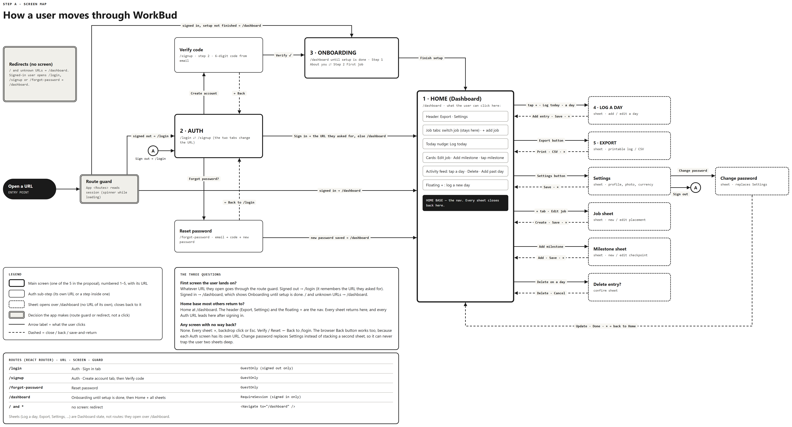
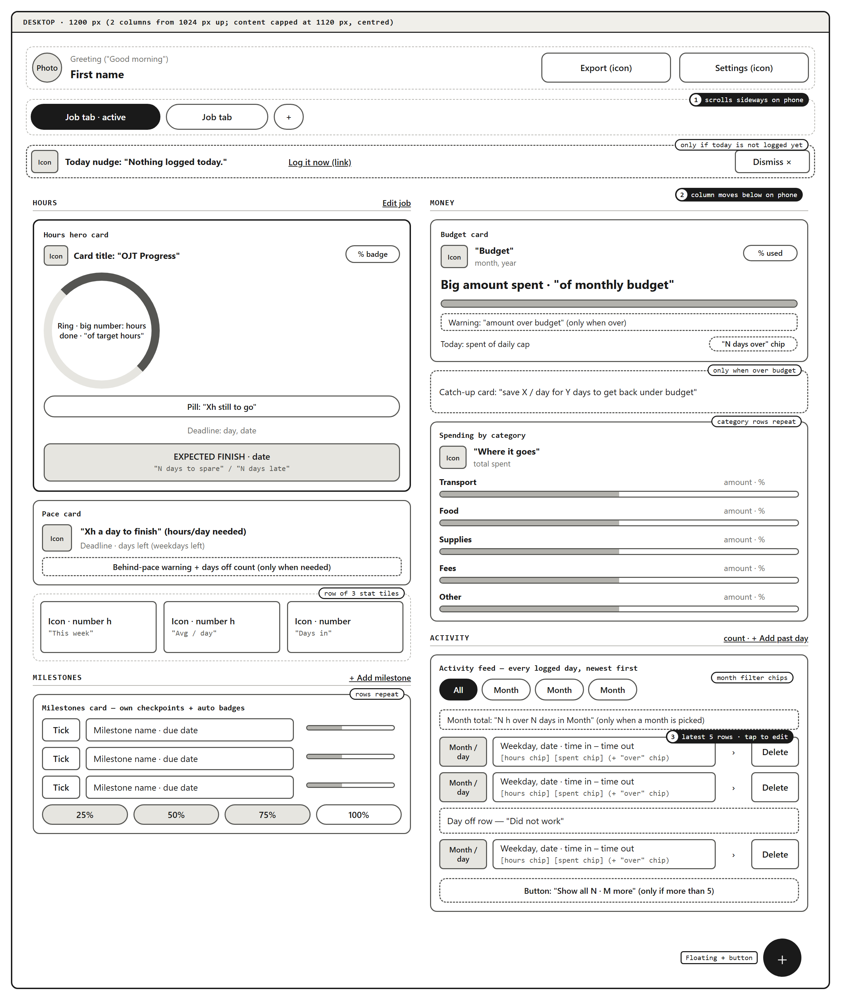
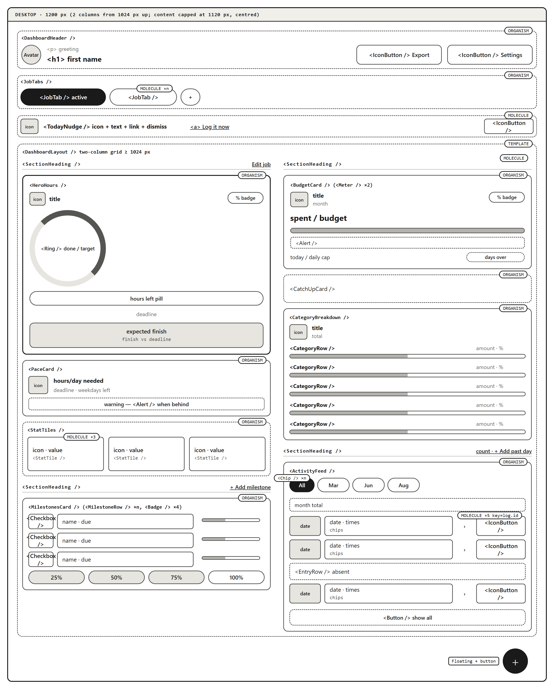

# Mockup

What WorkBud looks like, with its real colours, type, spacing and content, next
to the wireframes it was built from. Every image is in [assets/](assets/).

## The app

Captured from the deployed app at
[workbud-ph.vercel.app](https://workbud-ph.vercel.app/) in a phone-sized
viewport, because the app is built mobile first. These are the five screens in
the [proposal](01-proposal.md), plus Settings, which the proposal keeps as a
secondary sheet opened from Home.

| Auth | Onboarding | Home (Dashboard) |
|---|---|---|
|  |  |  |

| Log a day | Export | Settings |
|---|---|---|
|  |  |  |

| Screen | What it shows |
|---|---|
| Auth, `/login` and `/signup` | Sign in or create an account. Signup finishes with an emailed code typed into the app. |
| Onboarding, at `/dashboard` until setup is done | Step 1, about you: name, age and occupation. Step 2, your first job: its name, currency, target hours and monthly budget. |
| Home, `/dashboard` | Header, job tabs, today nudge, the hours ring, pace card, stat tiles, milestones, budget meters, category breakdown and the activity feed. |
| Log a day, a sheet over `/dashboard` | Date shortcuts, time in and out, break minutes, a note, and the day's expenses as separate items. |
| Export, a sheet over `/dashboard` | A date range and a choice between the plain time log and the full record. |
| Settings, a sheet over `/dashboard` | Profile details, profile picture, currency, password and sign out. |

**Empty states.** With no job yet, Home replaces its cards with a "No job yet"
message and an "Add a job" button. With a job and no logged days, the activity
feed reads "No entries yet".

## The wireframes it came from

The prelim wireframes are finished and are not being redone. They are here so
the plan and the result can be compared.

### Screen map

One box per screen, labelled with its URL, and an arrow for every navigation.
Solid arrows are user actions; dashed arrows are close, back, or save and
return. Dashed boxes are sheets that open over `/dashboard`.

| URL | Screen | Who may open it |
|---|---|---|
| `/login` | Auth, Sign in tab | signed-out users |
| `/signup` | Auth, Create account tab, then the Verify code step | signed-out users |
| `/forgot-password` | Reset password (email, then code and new password) | signed-out users |
| `/dashboard` | Onboarding until setup is done, then Home. All sheets open over it. | signed-in users |
| `/` and any other URL | no screen | redirects to `/dashboard` |

### Home, desktop

The busiest screen, at 1200px. On a phone the two columns become one: Hours
first, then Money, then Activity.

### Home, broken into components

The same screen with every repeated or self-contained piece boxed and named.

## Where the build differs from the wireframes

- **Component folders.** The wireframes planned `atoms/`, `molecules/`,
  `organisms/` and `templates/` folders. The build keeps every component in one
  flat folder, [client/src/components/](../client/src/components/), with the
  small shared pieces together in `ui.jsx`.
- **Some planned components were never split out.** `StatTile`, `EntryRow`,
  `ExpenseRow`, `CategoryRow`, `JobTab`, `IconButton`, `SegmentedControl` and
  `DashboardLayout` are drawn as their own components in the wireframe. In the
  build that markup is written inline in the parent (`StatTiles`,
  `ActivityFeed`, `LogSheet` and so on). `MilestoneRow`, `Chip`, `BrandPanel`
  and `ConfirmDelete` do exist, but as small functions inside their parent's
  file, not as files of their own.
- **Expenses.** Individual expense lines can be added, but editing and deleting
  a single line is not finished.
- **Loading.** There are no loading skeletons. This is listed under next steps
  in the main [README](../README.md).
