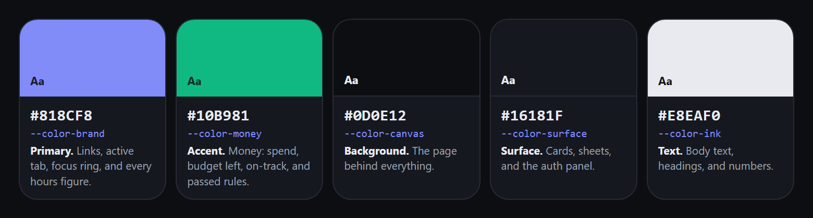
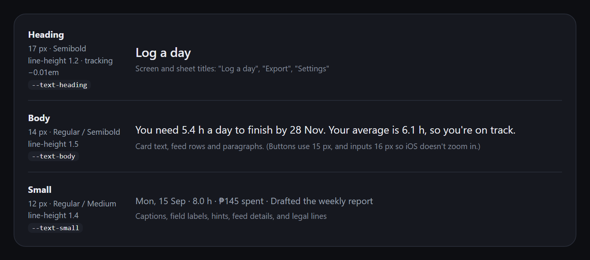
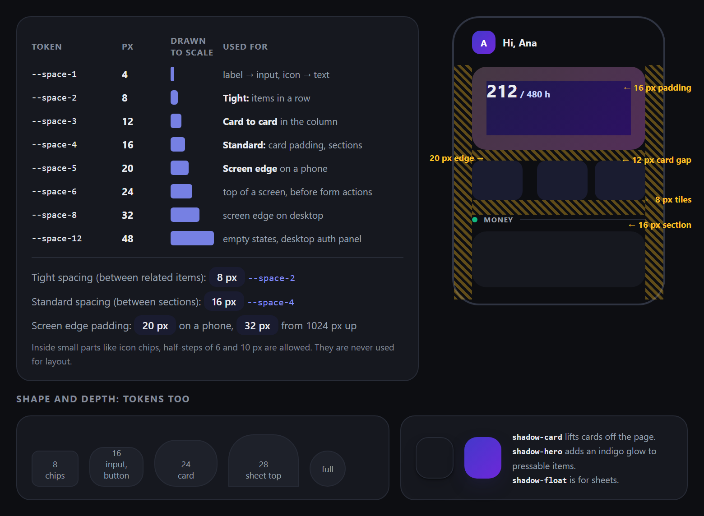
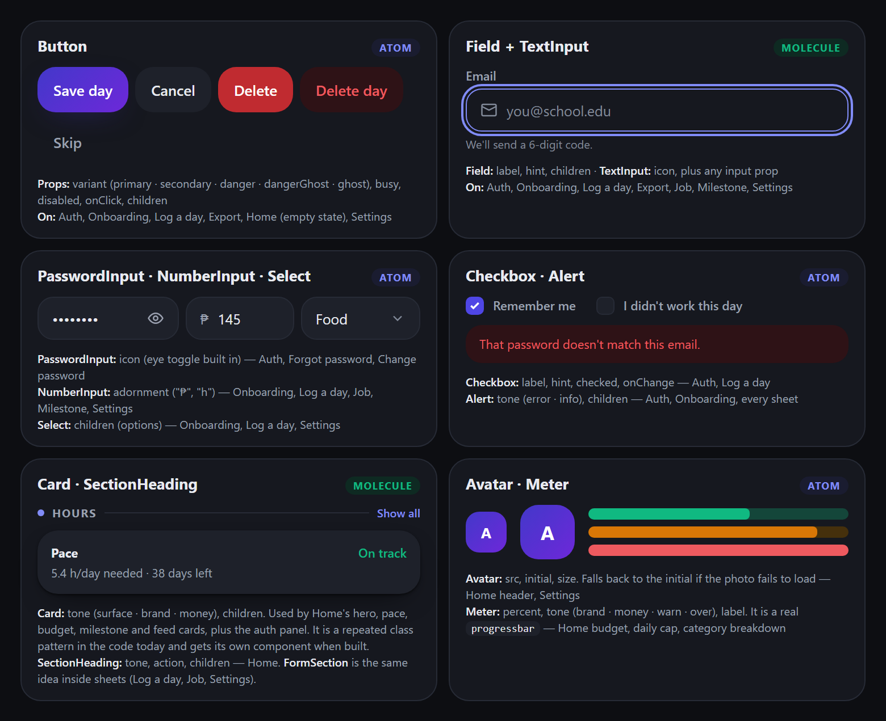
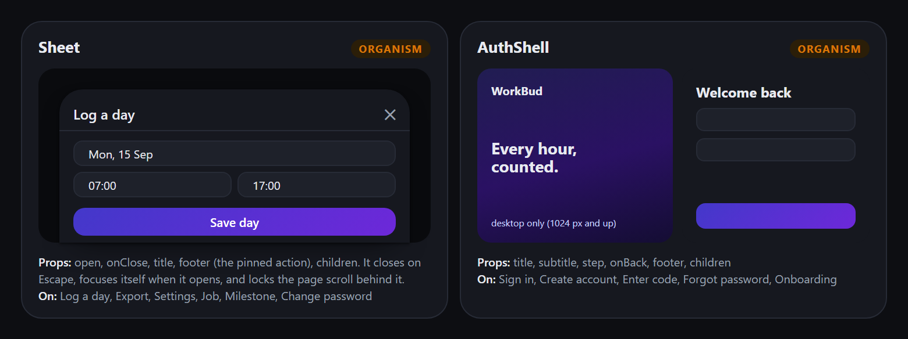
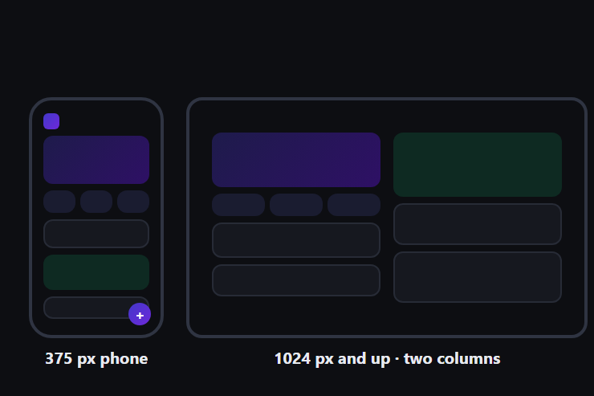

# WorkBud Design System

## 3. Design System

**WorkBud**: the tokens and components every WorkBud screen shares. All values
are taken from the app's stylesheet, `client/src/index.css`, and its components
in `client/src/components/`.

## Step A: Choose your styling approach

| Layer | Where WorkBud's tokens live | Example |
|---|---|---|
| **Raw values** | `:root` custom properties in `client/src/index.css` | `--wb-surface: #16181f` |
| **Tailwind tokens** | the `@theme` block in `client/src/index.css` (Tailwind v4 has no `tailwind.config.js`) | `--color-surface: var(--wb-surface)` |
| **In components** | the class names Tailwind generates from `@theme` | `bg-surface`, `text-muted` |

My approach: **Tailwind CSS v4**, with no UI library. The app has one dark
palette only, and icons come from `lucide-react`.

## Step B: Colour tokens

| Token | Role | Your colour (hex) |
|---|---|---|
| `--color-brand` | hours: links, active job tab, focus ring, and every hours figure | **#818CF8** |
| `--color-money` | money: amount spent, budget left, "on track" | **#10B981** |
| `--color-canvas` | page background | **#0D0E12** |
| `--color-surface` | cards, sheets, and the sign-in panel | **#16181F** |
| `--color-ink` | body text, headings, and numbers | **#E8EAF0** |

Buttons, the "+" button and the avatar use `bg-action`, a gradient made from the
brand colour (#4338CA → #6D28D9). Two more colours are only for warnings:
`--color-warn` #D97706 (behind pace) and `--color-over` #EE5A5F (over budget,
errors).

**Contrast:** I checked all 23 text-on-background pairs in the app with the
WCAG formula, the same one WebAIM uses. They all pass 4.5 : 1, and the lowest
is 4.63 : 1. The main pairs:

| Text | On | Contrast |
|---|---|---|
| `ink` #E8EAF0 | `surface` #16181F | 14.74 : 1 |
| `muted` #9BA1B0 | `surface` #16181F | 6.85 : 1 |
| `faint` #828A99 | `surface-2` #1E212A | 4.63 : 1 |
| `brand` #818CF8 | `surface` #16181F | 5.94 : 1 |
| `money` #10B981 | `surface` #16181F | 6.99 : 1 |
| white | `bg-action` #4338CA → #6D28D9 | 7.90 / 7.10 : 1 |

*Figure 1: WorkBud's five colors.*

## Step C: Type scale

| Style | Size | Weight | Used for |
|---|---|---|---|
| Heading | 17px | Semibold | sheet titles ("Log a day", "Export", "Settings") |
| Body | 14px | Regular / Semibold | card text, feed rows, paragraphs |
| Small | 12px | Regular / Medium | captions, field labels, hints, feed dates |

The font is the system stack (`-apple-system, "Segoe UI", Roboto, sans-serif`),
so nothing downloads. A few places sit outside the scale on purpose:

- the big hours number in the hero card is 40px Bold
- buttons are 15px Semibold
- inputs are 16px, so iOS doesn't zoom in when a field is tapped
- the Home greeting is 19px, and the sign-in title is 27px (31px on desktop)

*Figure 2: The three sizes at their real size.*

## Step D: Spacing rule

Base unit: **4px**, which is Tailwind's own step. The tokens count in fours, so
`--space-2` = 8px and `--space-4` = 16px.

- Tight spacing (between related items): **8** px (`--space-2`)
- Card to card in the column: **12** px (`--space-3`)
- Standard spacing (between sections): **16** px (`--space-4`), which is also
  the padding inside cards
- Screen edge padding: **20** px on a phone, and **32** px from 1024px up

*Figure 3: The spacing scale drawn to size, and a Home screen with its spacing
measured out.*

## Step E: Reusable components

| Component | Level | Appears on | Props it takes |
|---|---|---|---|
| `Button` | atom | Auth, Onboarding, Log a day, Export, Home | `variant`, `busy`, `disabled`, `onClick`, `children` |
| `TextInput` | atom | Auth, Onboarding, Log a day, Export | `icon`, plus input props |
| `PasswordInput` | atom | Auth (sign in, sign up, forgot password), Home (change password) | `icon`, plus input props |
| `NumberInput` | atom | Onboarding, Log a day, Home (job and settings sheets) | `adornment`, plus input props |
| `Select` | atom | Onboarding, Log a day, Home (settings sheet) | `children`, plus select props |
| `Checkbox` | atom | Auth ("Remember me"), Log a day ("I didn't work") | `label`, `hint`, `checked`, `onChange` |
| `Alert` | atom | Auth, Onboarding, Log a day, Export, Home | `tone`, `children` |
| `Field` | molecule | Auth, Onboarding, Log a day, Export, Home sheets | `label`, `hint`, `children` |
| `FormSection` | molecule | Log a day, Home (job and settings sheets) | `label`, `icon`, `tone`, `action`, `children` |
| `Sheet` | molecule | Log a day, Export, Home (settings, job, milestone, password) | `open`, `onClose`, `title`, `footer`, `children` |
| `AuthShell` | organism | Auth (sign in, sign up, code, forgot password), Onboarding | `title`, `subtitle`, `step`, `onBack`, `footer`, `children` |

- **Card:** Home's cards all share the same classes (`rounded-3xl bg-surface p-4
  shadow-card`). It is a repeated pattern, not a component yet.
- **Header/nav:** `DashboardHeader` appears only on Home, so it isn't a shared
  component. The app has no nav bar, because every other screen opens as a
  sheet over Home.
- **Footer:** there is no app-wide footer. The small legal line on the sign-in
  screens is `AuthShell`'s `footer` prop.
- **UI library:** none, so I build everything myself. Only the icons come free,
  from `lucide-react`.

*Figure 4: Component sketches.*

*Figure 5: Sheet and AuthShell.*

## Step F: Responsive plan

- Below **640** px (phone): one column with a 20px edge. Sheets slide up from
  the bottom, and the "+" button floats bottom-right
- **640–1023** px (tablet): the column is capped at 600px, and sheets become a
  centred pop-up
- Above **1024** px (desktop): Home splits into two columns (hours on the left,
  money on the right). Sign-in shows the brand panel beside the form

These map to Tailwind's `sm:` (640) and `lg:` (1024). There is no sideways
scroll at 375px: the page body has `overflow-x: clip`, and every field has
`min-width: 0`.

*Figure 6: Home at 375px and at 1024px and up.*

## Accessibility check (before you build)

- [x] Every text-on-background pair passes 4.5 : 1 contrast. All 23 pairs pass;
      the lowest is 4.63:1.
- [x] Real semantic elements: `<header>`, `<main>` and `<aside>`, and `<button>`
      for every tap target. Sheets use `role="dialog"`, and there are no
      clickable `
`s. (There is no `<nav>`, because the app has no nav bar.)
- [x] Images have alt text. The logo is an SVG with `aria-label="WorkBud"`. The
      profile photo uses `alt=""`, because the name is printed beside it.
- [x] Every input has a label. `Field` wraps each input inside its `<label>`,
      which links them without needing `htmlFor` and `id`. Icon-only buttons
      have an `aria-label`.
- [x] Every button and link is reachable with Tab and shows a focus ring (a 2px
      brand-colour outline). Escape closes a sheet.

## What to keep

- **Tokens:** kept in `client/src/index.css` (`:root` and `@theme`). New code
  uses the class names only, never a hex code.
- **Components:** built once in `client/src/components/`. The atoms and
  molecules are in `ui.jsx`; `Sheet` and `AuthShell` have their own files.
- **Responsive:** write the phone layout first, then add `sm:` and `lg:`, and
  check every screen at 375px wide.
